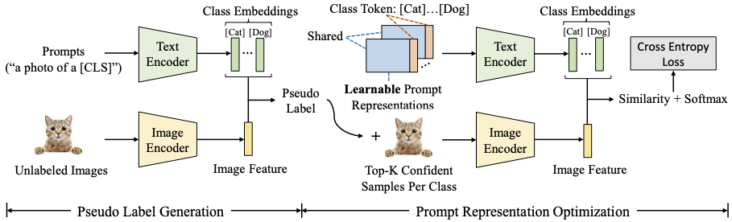

# Unsupervised Prompt Learning for Vision-Language Models


## Introduction

This repo is the official implementation of **Unsupervised Prompt Learning for Vision-Language Models**. UPL is the first framework to introduce unsupervised learning into prompt learning of vision-language models to avoid time-consuming prompt engineering and better adapt vision-language models for the downstream image recognition task.

Contact us with tonyhuang_pku@outlook.com or fawe@microsoft.com.


<center>


Fig.1 Overview of Unsupervised Prompt Learning (UPL) Framework.
</center>

## Install

The code is built on the [CoOp](https://github.com/KaiyangZhou/CoOp) and [Dassl](https://github.com/KaiyangZhou/Dassl.pytorch) with commit `ac6e44194b2f90e325f477aadd6d9bc3a92ce255`, so you need to install the dassl environment first. You can follow the [instructions](https://github.com/KaiyangZhou/Dassl.pytorch#installation) to install *dassl* as well as *PyTorch*. After that, run `pip install -r requirements.txt` under `UPL/` to install a few more packages required by [CLIP](https://github.com/openai/CLIP).

**We also prepare all installation commands for you**:

```bash

############ install Dassl ############

# Clone this repo
git clone https://github.com/KaiyangZhou/Dassl.pytorch.git
cd Dassl.pytorch/
git reset --hard ac6e44194b2f90e325f477aadd6d9bc3a92ce255

# Create a conda environment
conda create -n dassl python=3.7

# Activate the environment
conda activate dassl

# Install dependencies
pip install -r requirements.txt

# Install torch (version >= 1.7.1) and torchvision
conda install pytorch==1.8.1 torchvision==0.9.1 cudatoolkit=10.1 -c pytorch

# Install this library (no need to re-build if the source code is modified)
python setup.py develop

############ install UPL ############

# Enter the directory at the same level as Dassl
cd ..

# Clone this repo
git clone https://github.com/tonyhuang2022/UPL.git
cd UPL/

# Install CLIP dependencies
pip install -r requirements.txt

######## attention ########
# We have two soft links, and you can redirect them!
# The `data` is linked to the datasets, and the `temp_analyze_results_miltiple` is linked to the `info`.
# We strongly recommend that you create these two paths under the disk which have enough space, and then use

rm data temp_analyze_results_miltiple # remove the existing file 
ln -s ${your_data_path} ./data
ln -s ${your_temp_analyze_results_miltiple_path} ./temp_analyze_results_miltiple

# Finished
```


## Datasets

After that, you can follow the [CoOp Datasets Instructions](https://github.com/KaiyangZhou/CoOp/blob/main/DATASETS.md) to prepare the datasets. 

Then, you can run the code ~

## Training

Note that we need to obtain the pseudo labels of the train sets, so you need to run the `get info` step under `UPL/scripts` before training to obtain the needed files (e.g., logits).

### get info of RN50


```python
CUDA_VISIBLE_DEVICES=0 bash get_info.sh sscaltech101 anay_rn50 end 16 -1 False
```

You can change the config file to get the info from other models (e.g., anay_rn101, anay_rn50x4). We also prepare a script for getting info from all CLIP released models.

```python
CUDA_VISIBLE_DEVICES=0 bash get_all_info.sh sscaltech101
```


### UPL train 

After `get info` step, we can train the prompt (default run 16 seeds, you can change it in `UPL/configs/UPLTrainer/rn50_ep50.yaml`):

```python
CUDA_VISIBLE_DEVICES=0 bash upl_train.sh sscaltech101 rn50_ep50 end 16 16 False True rn50_random_init
```

If you want to use *UPL**, please change the `PSEUDO_LABEL_MODELS` in  `UPL/configs/UPLTrainer/rn50_ep50.yaml`. Please ensure that you have obatined info from all released models. Then, you can run

```python
CUDA_VISIBLE_DEVICES=0 bash upl_train.sh sscaltech101 rn50_ep50 end 16 16 False True multiple_models_random_init
```


## Testing

### Test with existing files after UPL training

```python
bash upl_test_existing_logits.sh sscaltech101 rn50_ep50 end 16 16 False True
```

## Thanks

We use code from [CoOp](https://github.com/KaiyangZhou/CoOp) and [Dassl](https://github.com/KaiyangZhou/Dassl.pytorch), which are great repositories and we encourage you to check them out and cite them in your work.